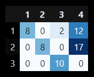

# Vogel Approximation Method (VAM) 
[](https://colab.research.google.com/github/faridnec/vogels-approx-method/blob/farid-main/vogels_am.ipynb)

> View these instructions in [Turkish](./translation/tr/README.md)


## Overview
The example transportation problem for the output above is as follows
```markdown
                            ------------------------------------------------------------
                                      | Store 1 | Store 2 | Store 3 | Store 4 | Supply  
                            ------------------------------------------------------------
                            Factory 1 |   10    |   19   |   5    |   7     |   22    
                            Factory 2 |   13    |   2    |   7    |   8     |   25  
                            Factory 3 |   15    |   18   |   6    |   14    |   10  
                            ------------------------------------------------------------ 
                            Demand    |   8     |   8    |   12   |   29    |   57     
                            ------------------------------------------------------------
```
## Introduction
Vogel's Approximation Method (VAM) is an algorithm used for solving transportation problems in linear programming. A transportation problem involves minimizing the cost of transporting goods from multiple suppliers to multiple consumers. Vogel's method provides an iterative approach to find an initial feasible solution, which can then be improved using other optimization techniques.

Reference:  
BYJU's. (n.d.). Vogel's Approximation Method. BYJU's. https://byjus.com/maths/vogels-approximation-method/

Here is the project structure:
```plaintext
vam-method/
|-- img/
|-- modules/
|   |-- vam.py          # VAM algorithm
|   |-- utils.py        # utility outside VAM & styling
|-- main_script.py      # running VAM
|-- vogels_am.ipynb     # explanation of the method
└── README.md   
```

## Installation
This project using numpy library assuming you have got pip installed on your system. Install numpy on your repository
```bash
# Installing NumPy
pip install numpy

# Installing Pandas
pip install pandas
```

## Output
You can check the implementation of algorithm using scenario and styling on `vogels_am.ipynb` [here](./vogels_am.ipynb)

Output example on jupyter notebook:



> or by

Running main_script.py by this command

```bash
python main_script.py
```
Here is the output from previous example:
```markdown
// Iteration and process will be shown here ...

Total Cost (Optimized): 386 units

Transportation Plan:
[[ 8  0  2 12]
 [ 0  8  0 17]
 [ 0  0 10  0]]
```
